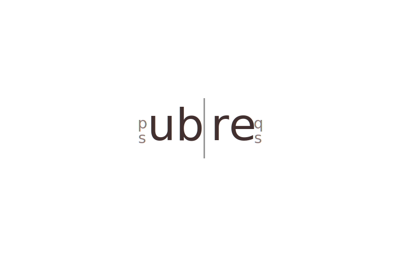

**Ubre is a small json spec for supporting pub/sub & request/response message passing.**

It can be used on any kind of connection that supports sending / receiving json messages, but was created with websockets in mind. It should be easy to use for communicating through iframes, service workers and similar avenues.

It is not concerned with deliverability or connection management, but is intended simply as a comman format for req/res and pub/sub messaging.

You can find an opinionated implementation of UBRE in javascript which can be used on the server, and in the browser. 

## Message Formats

### pub / sub

> publish, subscribe, events

Used to subscribe / publish. The handling of subscriptions according to the name is entirely up to the client.

#### `subscribe`

```
{
    "subscribe": "some topic"
}
```

#### `publish`

```
{
    "publish": "some topic",
    ["body": "some topic data"]
}
```

#### `unsubscribe`

```
{
    "unsubscribe": "some topic"
}
```

### req / res

> rpc, rest, graphql

#### `request`

```
{
    "request": "unique id",
    ["body": "some request body"]
}
```

#### `success`

```
{
    "success": "id",
    ["body": "some success data"]
}
```

#### `fail`

```
{
    "fail": "id",
    ["body": "some fail data"]
}
```
